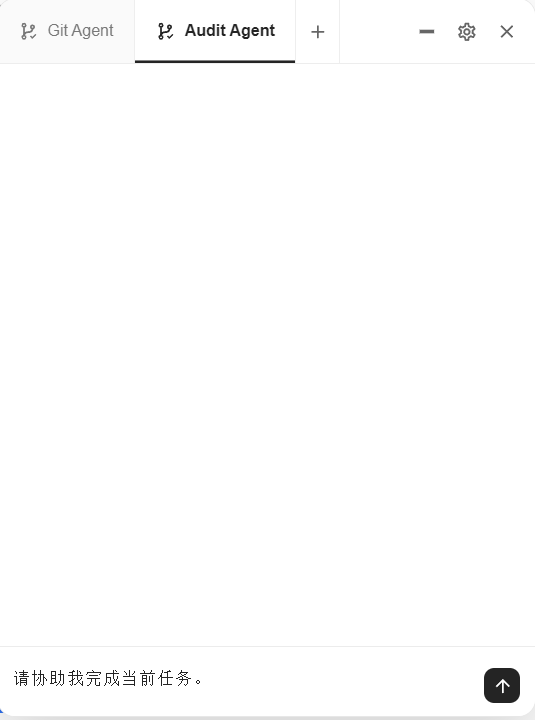
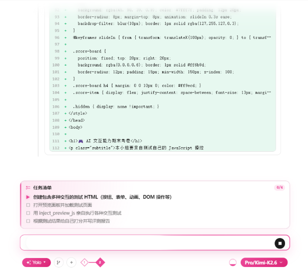
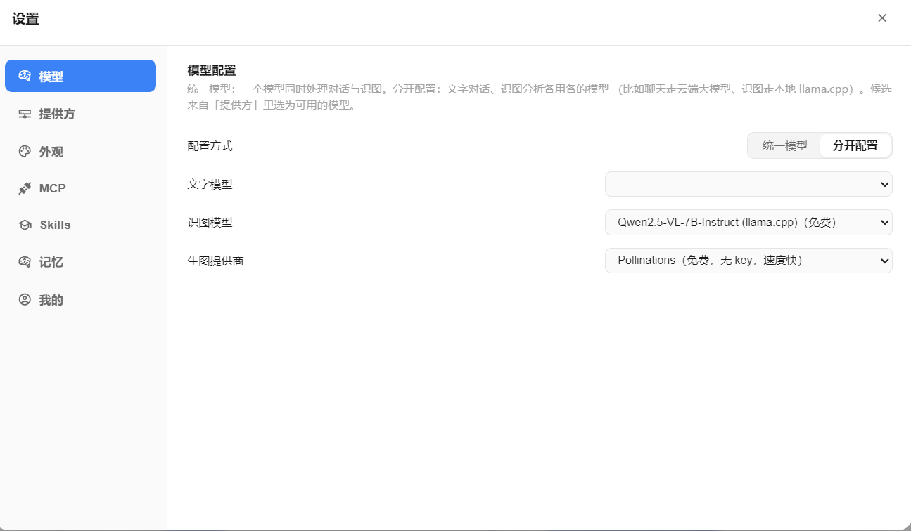
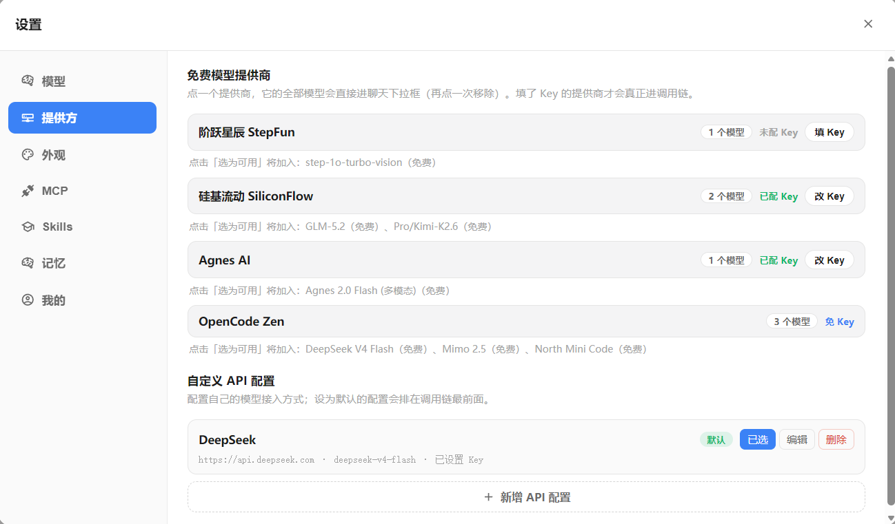

[English](./README.en.md) · [中文](./README.md) · [正体中文](./README.zhtw.md) · [日本語](./README.ja.md) · [Tiếng Việt](./README.vi.md) · [தமிழ்](./README.ta.md)

# ResceneAgent

> **国内首个为编程而生的真免费 Vibe Coding 工作台**：免费 Token、本地运行、功能齐全。


<p align="center">
  <a href="./LICENSE"></a>
  
  
  
</p>

## Vibe Coding，不该是一场资格赛

今天想认真用 AI 编程，开发者常常先被挡在代码之外：

- **国外头部工具正在形成新的平台壁垒**：Claude Code、Codex 很强，但账号、地区、价格、配额和服务规则都掌握在厂商手里。地区不可用、账号被停、套餐调整，任何一项都可能让工作流突然中断。
- **Agent 越强，安全边界越不能靠运气**：能读代码、跑 Shell、访问网络，就也可能遭遇提示词注入、依赖投毒、凭据泄露和误删文件。把整个项目交给闭源黑盒，开发者很难真正审计每一步。
- **换成国内服务，常见的仍是限流、付费和排队**：免费额度只够试用，高峰期要等，真正能完成长任务的上下文、模型和工具又被放进更贵的套餐。
- **很多所谓“免费 Coding”只是聊天框**：能回答问题，却没有文件树、终端、Diff、浏览器验收、回滚和多 Agent 编排，最后还是要你自己拼完交付链路。

我不想让写代码变成“先买订阅、再抢额度、最后祈祷别封号”。

所以我做了 **ResceneAgent**：一个面向国内开发者、真正为编程而生的 Vibe Coding 工作台。不是再套一层聊天 UI，而是把免费模型、Agent、IDE、终端、真实浏览器、Git、MCP、技能和安全审计放进同一个本地工作流。

> **Clone 下来就能跑。不开会员，不绑信用卡，不购买 Token，也能开始 Vibe Coding。**

<sub>这些风险不是危言耸听：OpenAI 官方说明，在不受支持的地区访问 API 可能导致账号被封禁或暂停；Anthropic 官方披露会依据支持地区与使用政策暂停或终止账号。两家公司也都在安全文档中明确提示 Coding Agent 的提示词注入、恶意代码与数据泄露风险。参见 [OpenAI 支持地区](https://help.openai.com/en/articles/5347006-openai-api-supported-countries-and-territories)、[Anthropic 透明度中心](https://www.anthropic.com/transparency/system-trust-reporting)、[Claude Code 沙箱说明](https://www.anthropic.com/engineering/claude-code-sandboxing) 与 [Codex 网络访问风险](https://deploymentsafety.openai.com/gpt-5-3-codex/cybersecurity)。</sub>

## “真免费”具体是什么

| 你真正关心的 | ResceneAgent 怎么做 |
| --- | --- |
| **免费 Token** | 内置免 Key 免费模型池，无需购买官方订阅即可开始；免费源失败时自动熔断并切换。你也可以接入自己的 Key。 |
| **本地运行** | 前端、后端、工作区、会话和审计记录都运行并保存在本机；还可接入 Ollama / llama.cpp，让模型推理也留在本地。 |
| **功能齐全** | Monaco 编辑器、文件树、终端、实时 Diff、TODO、多 Agent、MCP、技能市场、图片生成、真实 Chromium 预览与截图验收，一套工作台全部提供。 |
| **不锁平台** | 模型与提供方可自由配置，云端免费模型、私有 API Key、本地模型可以并存；某一家不可用，不必连工具一起换掉。 |
| **安全可控** | AgentFS 隔离改动并支持 Diff / 回滚；删除、移动等危险操作必须由人批准，YOLO 模式也不能绕过。 |

> [!NOTE]
> “免费”指 ResceneAgent 本身开源、无需订阅即可使用，并提供免 Key 免费模型入口；第三方免费模型的额度与可用性可能变化。本地模型不受第三方 Token 额度影响。

## 好看不是花瓶

ResceneAgent 支持自定义动态壁纸、灵动动画和主题配色。写代码不必再盯着枯燥的 IDE：打开氛围、描述想法，Agent 会生成项目、渲染预览并持续迭代；每次文件修改都有清晰的流式反馈——从 Diff 高亮到渐变瀑布，每个细节都经过打磨。

你可以像聊天一样说“帮我做一个可爱的待办页面”，它会生成项目、启动真实 Chromium 预览，你还能亲手点击验收；不满意就回滚，危险操作它会先问你。**Vibe 归 Vibe，交付归交付。**

## 二次元与 UI 体验 First

- **用户自定义壁纸**：选择本地动态视频作为工作台背景，自由调节遮罩、面板透明度与模糊
- **丝滑动画**：文件编辑、Diff、TODO 进度、工作流节点都有渐变与流式反馈
- ** Monaco + 文件树 + 终端**：聊天面板里直接集成完整的开发环境，不用跳来跳去
- **可自定义 Agent 编排**：给不同 Agent 换上专属头像与系统提示词，让它们在一条工作流里接力




## 前端编程与设计

- **一句话生成网页**：描述需求即可生成完整前端项目，自动构建并启动预览
- **真实 Chromium 预览**：不是 iframe，是真实浏览器；你可以点击、输入、滚动，Agent 也能读取 DOM 状态
- **设计迭代友好**：改颜色、改布局、加组件，说一句话就行；修改过程以 Diff 和截图证据呈现
- **图片生成内嵌**：对话里直接生成素材，立刻用作前端资源


## Agent 内核：好看，也能打

| 能力 | 常见对话式 Coding Agent | ResceneAgent |
| --- | --- | --- |
| 自定义 Agent 编排 | 通常单一 Agent 硬编码 | 创造多个专门 Agent，按名称与系统提示词编排，在工作流中调度接力 |
| 任务计划 | 隐藏在模型内部 | 实时 `TODO`：`pending / doing / done`，前端同步展示 |
| 主动向人确认 | 自由文本追问 | `ask_user` 结构化提问，回答原地回流工作流 |
| 中断后的继续执行 | 依赖会话实现 | 每轮快照消息、工具、TODO 与 Token 计数，可断点续传 |
| 文件 edit 过程 | 整段结果或黑盒调用 | SSE 流式瀑布 + 渐变呈现：新增/删除计数、流式内容与最终 Diff |
| 运行后的网页验收 | 截图、iframe 或另开浏览器 | 真实 Chromium + CDP Screencast；鼠标、键盘可双向交互 |
| 感知用户真实交互 | 只看到代码或另起截图 | 读取同一 live 预览页：点击、输入、滚动后的截图与 DOM 都可回流 Agent |
| 交付证据 | 文字说明 | 页面截图按工具调用顺序成为 artifact，可按需展开 |
| 安全交付闭环 | 依赖模型自觉或直写工作目录 | 危险操作系统门阀（YOLO 也无豁免）+ AgentFS 隔离/Diff/回滚 + 按改动类型构建与 CDP 验收 |
| 多模型路由与故障转移 | 手动逐个配置切换 | 自动熔断、失败秒切、确定性失效自动跳过 |
| 工作流可视化 | 较少提供 | Harness Flow 实时展示 Gateway / Memory / LLM / Tools / Reply 及 Trace / Eval / Release 链路 |



### 模型、提供方与扩展

模型可按文字对话、识图和生图能力分开配置；免费模型池、用户自填 API Key 与本地模型均可并存，并由路由器按可用性自动选择和故障转移。





### 全网 MCP + Skills 生态，一处富集

模型决定 Agent 有多聪明，生态决定它到底能做多少事。ResceneAgent 不只内置几个演示插件，而是把 **MCP 官方 Registry** 与主流 **Skills 开源仓库**直接接进工作台：搜索、筛选、接入、安装、启用都在设置页完成。

| 生态入口 | 你可以做什么 |
| --- | --- |
| **MCP 官方 Registry** | 实时搜索官方托管目录，一键接入可直接连接的 Streamable HTTP 服务；无需额外准备 Node、Python 或 `npx`，连接成功后立即成为 Agent 可调用的工具。 |
| **GitHub Skills 仓库** | 直接浏览并筛选 Anthropic、OpenAI 与 Vercel Labs 的公开技能仓库；安装时连同 `SKILL.md` 和附属文件完整保存到本地。 |
| **本地 MCP / Skills** | 自建 MCP、自写 Skill 与外部生态共存；可查看、启停和移除，不被任何单一平台锁定。 |
| **按需加载** | Agent 只在任务需要时加载对应工具和技能，既扩展能力，也避免把整座生态一次性塞进上下文浪费 Token。 |

<table>
  <thead>
    <tr>
      <th width="50%">MCP 官方 Registry</th>
      <th width="50%">GitHub Skills 生态</th>
    </tr>
  </thead>
  <tbody>
    <tr>
      <td></td>
      <td></td>
    </tr>
    <tr>
      <td valign="top"><code>设置 → MCP → 外部</code><br>搜索并接入可直连的远程服务；内置 Go Transport，无需额外安装 JavaScript 或 Python 运行时。</td>
      <td valign="top"><code>设置 → Skills → 外部</code><br>切换 Anthropic、OpenAI、Vercel Labs 技能源；一键安装并完整保存到本地。</td>
    </tr>
  </tbody>
</table>

> **一个工作台，连接全网工具；一个本地技能库，持续沉淀你的 Agent 能力。**

### 企业级安全门阀：能力越大，越不能越权

在 Coding IDE 里，`rm`、删除目录和移动文件不是“普通工具调用”。ResceneAgent 把它们视为不可逆边界：系统先拦截，再由用户决定是否放行；YOLO 模式只减少日常流程摩擦，绝不取消危险操作审批。再配合 AgentFS 的隔离快照，即使 Agent 的尝试失败，也不会把半成品或误操作直接写进你的工作目录。

### 交付不是“生成完就算完”

ResceneAgent 的收尾有一层明确的自检护栏：Agent 需要运行构建，并用真实浏览器渲染和截图验证结果；截图成为会话中的交付证据。它的目标不是让 Agent 看起来更忙，而是减少“代码写了、页面却没跑起来”的空交付。

## 系统架构


## 5 分钟运行

需要 Go >= 1.26、Node.js >= 22；Ollama 和 Docker 为可选依赖。

```bash
# 终端 1：后端
cd main-backend
go run cmd/server/main.go

# 终端 2：前端
cd main-frontend/beneficial-belt
npm install
npm run dev
```

访问 `http://localhost:4322`，即可体验二次元主题与默认免费模型池。

## 开源

核心前后端以 [MIT License](./LICENSE) 开源。

## 深入了解

| 想了解 | 位置 |
| --- | --- |
| 前端与后端结构 | [`main-frontend/beneficial-belt`](./main-frontend/beneficial-belt) · [`main-backend`](./main-backend) |
| 工作流/工具测试 | [`harness`](./harness) |
| 项目文档资产 | [`docs`](./docs) |
| 许可证 | [MIT](./LICENSE) |


---

## Star History

<a href="https://star-history.com/#Rescenix/ResceneAgent&Date">
  <picture>
    <source media="(prefers-color-scheme: dark)" srcset="assets/star-history-dark.png" />
    <source media="(prefers-color-scheme: light)" srcset="assets/star-history-light.png" />
    
  </picture>
</a>

<sub>由 [`scripts/gen_star_history.py`](scripts/gen_star_history.py) 生成，GitHub Actions 每日自动更新；点击图片查看实时数据。</sub>
