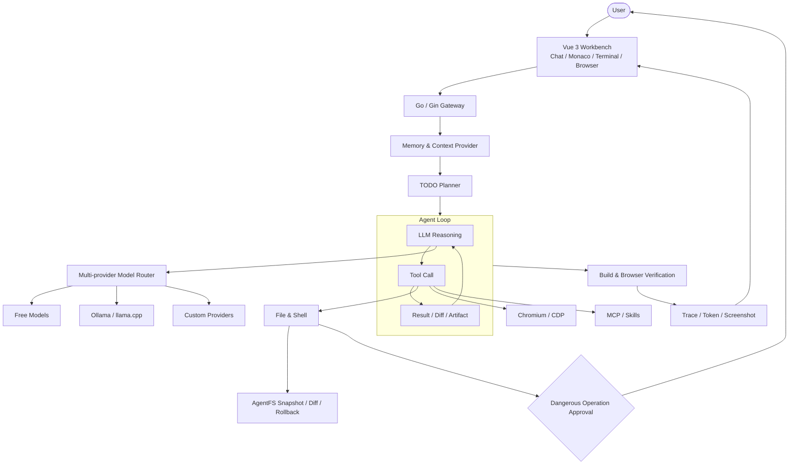

[English](./README.en.md) · [中文](./README.md) · [正体中文](./README.zhtw.md) · [日本語](./README.ja.md) · [Tiếng Việt](./README.vi.md) · [தமிழ்](./README.ta.md)

# ResceneAgent

> 本地优先、可扩展，并具备真实浏览器验收闭环的开源 AI 编程工作台。

<p align="center">
  <a href="./LICENSE"></a>
  
  
  
  
  
</p>


## 项目概述

ResceneAgent 是一个面向真实开发流程的 AI Coding 工作台。项目将模型路由、Agent 工作流、代码编辑器、终端、浏览器自动化、MCP、Skills 与变更审计整合在同一个界面中，覆盖：

**需求输入 → 任务规划 → 文件修改 → 构建运行 → 浏览器验证 → 结果交付**

与只输出代码片段的聊天工具不同，ResceneAgent 关注代码是否真正写入项目、能否构建、页面能否运行，以及整个过程是否可审计、可中断恢复和可回滚。

默认主 Agent 使用 Rescene 的二次元工程师人设；头像、系统提示词、动态壁纸与界面主题均可配置。人设属于产品体验设计，不影响底层工程能力。

## 核心能力

| 能力 | 说明 |
| --- | --- |
| **Agent 开发工作流** | 支持实时 TODO、结构化提问、多轮工具调用、任务中断恢复和交付验证。 |
| **集成开发环境** | 在聊天界面中提供 Monaco 编辑器、递归文件树、终端、流式 Diff 与工作流状态。 |
| **真实浏览器自动化** | 基于 Chromium 与 CDP 实现页面渲染、点击、输入、滚动、DOM 读取、截图和双向交互。 |
| **多模型路由** | 免费模型、自定义 API Key、本地 Ollama / llama.cpp 可并存，支持失败熔断与自动切换。 |
| **多 Agent 编排** | 可创建具有独立名称、头像与系统提示词的专业 Agent，并在任务中分工协作。 |
| **MCP 与 Skills 扩展** | 接入 MCP 官方 Registry，并支持浏览和安装 Anthropic、OpenAI、Vercel Labs 的公开 Skills。 |
| **AgentFS 变更审计** | 通过隔离快照、Diff 和回滚管理 AI 文件修改，减少失败任务对工作区的污染。 |
| **安全审批机制** | 删除、移动等危险操作必须经用户批准；YOLO 模式也不能绕过系统级门阀。 |

## 从生成代码到验证结果

一次典型的前端任务会经过以下阶段：

1. 根据用户目标创建结构化 TODO；
2. 搜索项目上下文并修改文件；
3. 运行依赖安装、构建或测试命令；
4. 启动真实 Chromium 预览并执行交互检查；
5. 将 Diff、日志和页面截图作为交付证据返回。

<table>
  <thead>
    <tr>
      <th width="50%">本地项目实时预览</th>
      <th width="50%">网页操作与截图回传</th>
    </tr>
  </thead>
  <tbody>
    <tr>
      <td></td>
      <td></td>
    </tr>
  </tbody>
</table>

## 工程设计

| 模块 | 实现方式 | 解决的问题 |
| --- | --- | --- |
| **工作流运行时** | Go Agent Loop + 结构化工具调用 + SSE 事件流 | 将规划、工具执行、观察和回复组织为可追踪流程。 |
| **上下文管理** | 项目记忆、会话历史、Token 分类统计与按需加载 | 减少重复上下文，控制长任务中的 Token 成本。 |
| **断点恢复** | 持久化消息、工具记录、TODO 与 Token 计数 | 浏览器刷新、断线或任务中断后可继续执行。 |
| **模型路由** | 多提供方目录、能力元数据、确定性错误跳过和故障转移 | 避免单个模型不可用导致整个工作流中止。 |
| **浏览器运行时** | Chromium DevTools Protocol、Screencast 与输入事件转发 | 在同一真实页面上实现人和 Agent 的双向操作。 |
| **文件安全** | AgentFS 隔离快照、变更 Diff、审批门阀与回滚 | 降低误修改、半成品写入和危险命令的影响。 |
| **扩展系统** | MCP Streamable HTTP、Skill 索引与任务匹配预加载 | 在不扩大常驻上下文的前提下扩展工具和专业流程。 |
| **交付验证** | 构建检查、真实浏览器渲染和截图 Artifact | 减少“代码已生成但无法运行”的无效交付。 |

## 模型与运行方式

| 方式 | 适用场景 |
| --- | --- |
| **免 Key 免费模型** | 无需先购买 Token 即可体验完整工作流；路由器会根据可用性选择模型。 |
| **自定义 API Key** | 可配置自己的模型提供方、Endpoint 和模型名称。 |
| **本地模型** | 支持 Ollama 与 llama.cpp，适合离线开发、隐私敏感项目或固定成本场景。 |
| **混合路由** | 文字、视觉和图片生成能力可分别配置，并在免费、私有与本地模型之间组合。 |

> [!NOTE]
> ResceneAgent 本身以 MIT License 开源，本地运行不要求购买会员。第三方免费模型的额度和可用性可能变化；使用远程模型时，请同时遵守相应提供方的数据与服务政策。

## MCP 与 Skills 生态

ResceneAgent 将外部工具和专业技能纳入统一设置页，同时保留本地配置与审计能力。

| 扩展入口 | 实现 |
| --- | --- |
| **MCP 官方 Registry** | 搜索并接入可直接连接的 Streamable HTTP 服务；内置 Go Transport，无需为远程 MCP 额外安装 Node、Python 或 `npx`。 |
| **GitHub Skills 仓库** | 浏览 Anthropic、OpenAI 与 Vercel Labs 的公开技能，将 `SKILL.md` 及同目录附属文件完整保存到本地。 |
| **本地扩展** | 自建 MCP、自定义 Skill 与外部生态共存，可查看、启停和移除。 |
| **按需加载** | 工具 Schema 与技能正文按任务需要加载，避免无关扩展长期占用上下文。 |

<table>
  <thead>
    <tr>
      <th width="50%">MCP 官方 Registry</th>
      <th width="50%">GitHub Skills 仓库</th>
    </tr>
  </thead>
  <tbody>
    <tr>
      <td></td>
      <td></td>
    </tr>
    <tr>
      <td valign="top"><code>设置 → MCP → 外部</code></td>
      <td valign="top"><code>设置 → Skills → 外部</code></td>
    </tr>
  </tbody>
</table>

## 系统架构



## 技术栈

| 层级 | 技术 |
| --- | --- |
| **前端** | Vue 3、Vite、Naive UI、Monaco Editor、GSAP、PixiJS |
| **后端** | Go 1.26、Gin、WebSocket、SSE |
| **Agent** | Tool Calling、实时 TODO、上下文压缩、Checkpoint、多 Agent 编排 |
| **浏览器** | Chromium、Chrome DevTools Protocol、Screencast |
| **扩展** | MCP Streamable HTTP、GitHub Skills、内置技能库 |
| **本地模型** | Ollama、llama.cpp、OpenAI-compatible API |
| **验证** | Go Test、前端构建、Python Harness、浏览器截图验收 |

## 下载

前往 [https://rescene.shanca.me/](https://rescene.shanca.me/) 全速下载最新版本。

## 快速开始

### 环境要求

- Go >= 1.26
- Node.js >= 22
- Ollama / llama.cpp（可选）
- Docker（可选）

### 启动后端

```bash
cd main-backend
go run cmd/server/main.go
```

### 启动前端

```bash
cd main-frontend/beneficial-belt
npm install
npm run dev
```

访问 [`http://localhost:4322`](http://localhost:4322)。

## 项目结构

```text
re0/
├── main-backend/                     # Go 后端、Agent 工作流、工具与模型路由
│   ├── cmd/server/                   # 服务入口
│   └── internal/handler/             # Workflow、AgentFS、Browser、MCP、Skills
├── main-frontend/beneficial-belt/    # Vue 3 工作台
├── harness/                          # 工具与工作流测试脚本
├── docs/                             # 文档与截图
└── runtime/                          # Chromium 等本地运行资源
```

## 开源协议

核心前后端以 [MIT License](./LICENSE) 开源。
