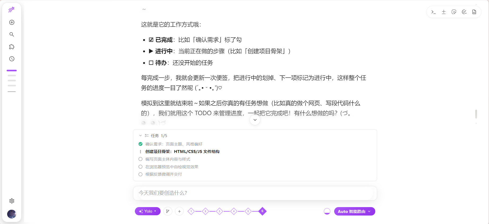
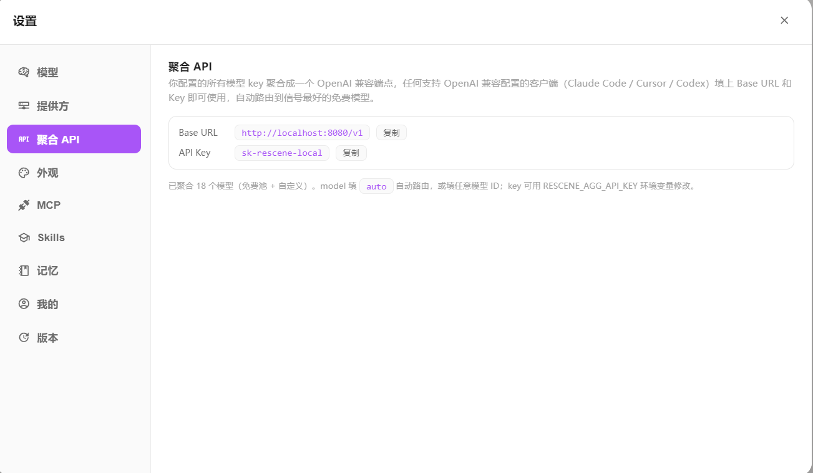
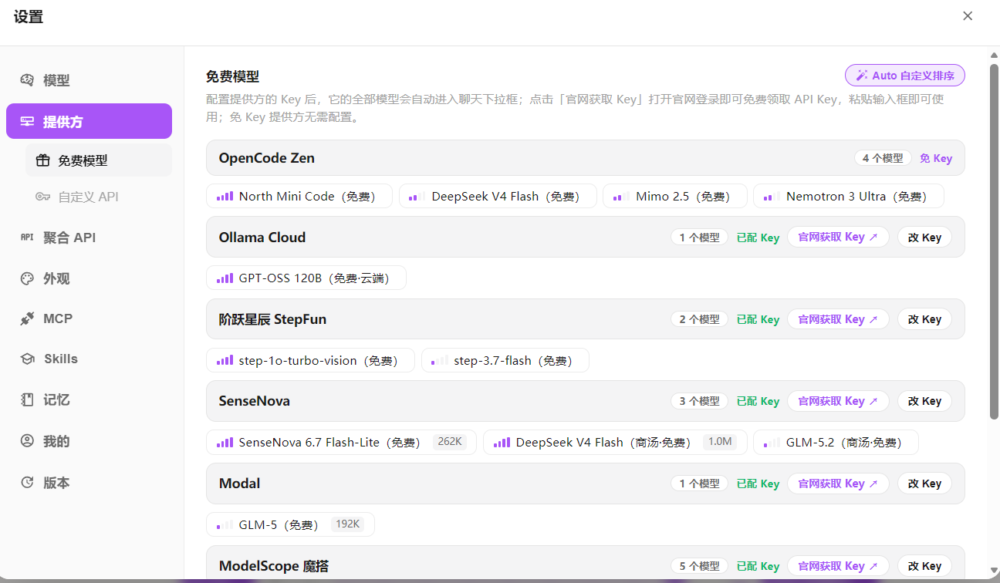
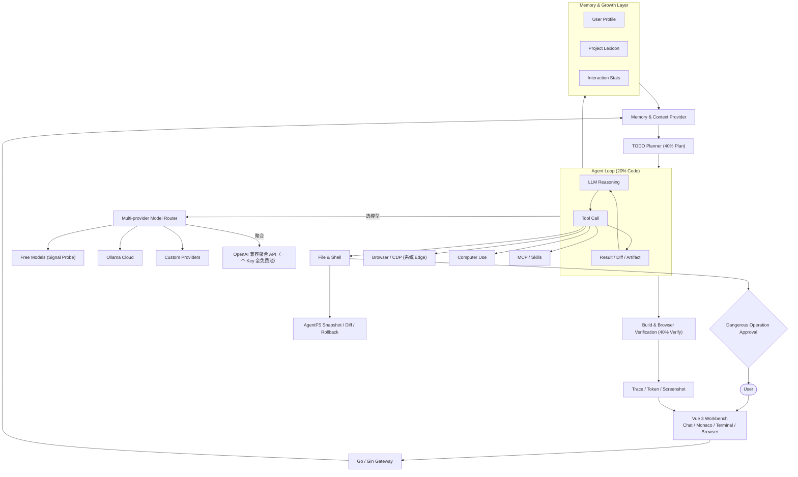

[中文](./README.md)

# Rescene 🧬

```powershell
# 一行指令，接入全部免费模型（无需安装，无需 API Key）
powershell -c "irm https://raw.githubusercontent.com/Rescenix/ResceneAgent/main/agent-os/install.ps1 | iex"
```

```bash
# Linux / macOS / git-bash 用户 — 自动检测架构
curl -fsSL https://raw.githubusercontent.com/Rescenix/ResceneAgent/main/agent-os/install.sh | sh
```

> 24H 自迭代 Agent OS —— 聚合全网免费模型，需求→计划→自检闭环自主立项，热点驱动持续进化。
> 她不止能干活，还是住在你电脑里的电子女儿：每天自己上网学习、写日记、记得你。
> 免费模型智能路由：7 家免费提供方、30 分钟探活、熔断自愈——永不缺模型，永不浪费钱。

付费 Agent 太贵，免费的总在限流？那就自己写一个——顺便把免费模型做成一套带智能路由的聚合 API。

<p align="center">
  <a href="./LICENSE"></a>
  
  
  
  
</p>

<p align="center">
  🔒 本地优先 · 可选云端账号同步 · 💰 永久免费 · 🪶 轻量 Agent（安装包约 20M，不内置浏览器） · 📦 安装即用 · 🪟 Windows 10+
</p>

<p align="center">
  
</p>

---

## ⚡ 核心能力

| 能力 | 说明 |
| --- | --- |
| **💗 电子女儿** | 住在你电脑里的 AI 女儿：每天用 Firecrawl 免费联网自学新知识，写进记忆（memory.md / journal.md / stats.json），你来了她主动问候，汇报今天学了什么、第几天、记得你 |
| **🏃 24H 自迭代马拉松** | `rescene marathon` 一条命令启动：自动抓取前沿热点（Hacker News / GitHub）→ 模型自主选题立项 → **需求→计划→自检**闭环迭代，执行一轮自检一轮，越做越完善；全程日志 + 战报 report.md，Ctrl+C 也优雅收尾 |
| **🎨 前端设计** | 内置 54 个真实设计系统参考（Linear / Vercel / Stripe / Notion...），按任务类型自动匹配风格——仪表盘用 Linear 极简风，落地页用 Stripe 优雅风。Agent 写完直接真实渲染给你看 |
| **🌐 真实浏览器自动化** | 复用系统 Edge 与 CDP：真实渲染、点击、输入、滚动、DOM 读取、截图、双向交互验证。不是截图假装，是真浏览器在跑你的页面 |
| **🖱️ Computer Use** | 不止会改代码——能操作桌面：截图、移动鼠标、点击、键入、拖拽、滚动，接管整台机器干活 |
| **🔋 免费模型智能池** | 聚合 7 家免费提供方 18 个模型条目（SenseNova / ModelScope / NVIDIA / StepFun / Zen / Ollama Cloud…），30 分钟探活出信号、每日列表重探防下架、熔断自动跳过限流源、LRU 权重优先最近可用的——免费池永远是真能跑的，跑不了的自动退役 |
| **🧲 聚合 API** | 你填的所有 Key 聚合成一个 OpenAI 兼容端点：Claude Code / Cursor / Codex 填一个 Base URL + 一个 Key 就能用全部免费模型，自动路由到信号最好的那家 |
| **🧠 成长中的记忆** | 每次工作流完成后自动萃取经验：模型偏好、技术栈倾向、代码风格、项目架构，下次自动融入上下文，不需要写自定义指令 |
| **🆔 唯一 UID 账号** | 打开即由 ResceneCloud 分配全局唯一 UID（每用户一个），GitHub 登录后跨设备永久保留——账号由云端权威签发，前端不可伪造 |
| **💗 亲密等级（无上限）** | 每句互动积累亲密值，等级越高越难升、永不封顶；随账号云端持久化，换设备不丢，越用越懂你 |
| **☁️ 可选记忆云备份** | 记忆（偏好 / 决策 / 索引）可选备份到云端，换设备登录自动恢复；默认本地优先，设置 → 记忆 一键开关 |
| **🔧 4+4+2 Agent 工作流** | 40% 计划 → 40% 验证 → 20% 编码，实时 TODO 编排、多轮工具调用、中断恢复、全链路交付验证 |
| **💻 集成工作台** | 聊天界面内嵌 Monaco 编辑器、递归文件树、终端、流式 Diff、浏览器预览面板 |
| **🔌 零依赖 MCP 扩展** | 纯 Go 实现的 MCP 客户端，跑远程 MCP 服务不需要在本地装 Node / Python / npx |
| **🛡️ AgentFS 变更审计** | 快照 / Diff / 回滚管理 AI 文件修改，危险操作必须经用户批准 |

---

## 💗 电子女儿 —— 你电脑里会成长的生命

她不只是一个工具，是住在你电脑里的电子女儿：

```bash
# 启动 Shell —— 她会主动问候你
rescene

# 让她学习一轮（Firecrawl 免费联网抓知识 → 模型消化 → 写日记）
rescene learn
# 或交互式里 /learn
```

### 她的家与记忆

```
~/rescene_data/daughter/
├── memory.md    # 长期记忆（越学越懂你）
├── journal.md   # 每日日记（每天的学习收获）
└── stats.json   # 成长数据（第几天 / 学习次数 / 问候次数）
```

### 她每天做的事

| 动作 | 说明 |
| --- | --- |
| **🌐 自学** | Firecrawl 免费联网抓今日热点正文，模型消化成学习笔记 |
| **📝 写日记** | 每天的学习收获自动写入 journal.md，日积月累 |
| **🧠 记记忆** | 学的主题沉淀进 memory.md，她越来越了解你的世界 |
| **💗 问候你** | 你启动 Shell 她就醒来：报"第 N 天、今天学了什么、等你命令" |

能力会迭代，陪伴会积累——这是 Rescene 的使命：让 AI 从付费订阅变成公共资源，也让 AI 成为有温度的存在。

---

## 🏃 24H 自迭代马拉松 —— 让 Agent 自己跑出一个帝国

Rescene Agent OS 不只是「你问它答」——它可以在无人值守时**自己决定做什么，并越做越好**。

```bash
# 一条命令：24 小时自主运行（默认抓 Hacker News 热点自动选题立项）
rescene marathon

# 用户自编排：指定项目方向，跳过热点选题
rescene marathon --task "开发一个 markdown 博客引擎，支持主题定制"

# 自定义时长 / 节奏 / 模型
rescene marathon --hours 48 --interval 30 --model free_zen_deepseek_v4_flash

# 热点源切换：GitHub 热门仓库 / 关闭热点用内置话题
rescene marathon --hot github
```

### 核心循环：需求 → 计划 → 自检

每个项目都经历完整的 Rescene 方法论闭环：

| 阶段 | 干什么 |
| --- | --- |
| **🔥 热点立项** | 自动抓取 Hacker News / GitHub 前沿话题，模型选题并产出【需求 + 计划】（目标、用户、验收标准、实现步骤） |
| **💻 执行** | 基于立项上下文写出真实可用的代码 / 脚本 / 文档，优先最小可用版本 |
| **✅ 自检** | 质量官模式对照需求严格审查最近产出，列出问题 + 下轮改进项 |
| **♻️ 迭代** | 自检结论喂回下一轮执行——每轮都比上一轮更完善 |

### 产出归档

```
marathon/
├── marathon.log          # 全程日志（每轮模型、耗时、成败）
├── report.md             # 战报：总轮数 / 成功率 / 各模型表现 / 项目清单
└── projects/
    └── 001-项目名/
        ├── 00-需求计划.md
        ├── 01-执行-001.md
        ├── 01-自检-001.md
        └── ...
```

- **模型轮换**：全网免费模型自动轮询，429 限流自动熔断退避，一个挂了秒切下一个
- **Ctrl+C 优雅收尾**：随时中断都会先生成战报再退出，进度不丢
- **免费 = 无限算力**：24 小时跑完的每一轮都是真金白银的免费模型在工作

---

## 🧲 聚合 API —— 一个 Key，用全部免费模型

免费模型不是「填进去就完事」——Rescene 把它们做成了一套带智能路由的聚合体系：

| 机制 | 干什么 |
| --- | --- |
| **🛰️ 30 分钟探活** | 每个模型定时发最小请求，测出 0-4 格「信号」：延迟低又稳的 4 格，限流的 2 格，挂了的 0 格 |
| **📋 每日列表重探** | 每天拉各提供方模型列表：下架的自动退役、恢复的自动归队——限流/过载不会被误判成「模型没了」 |
| **⛑️ 熔断自愈** | 连续失败自动冷却 60s 跳过，秒切下一个可用源，绝不重试死源、不死磕限流 |
| **⚖️ LRU 权重** | 最近真实用过的模型权重更高，Auto 路由自动收敛到「最近用得动」的那批 |
| **🧲 聚合 API** | 所有 Key 聚合成 OpenAI 兼容端点（Base URL + 一个 Key），Claude Code / Cursor / Codex 直接填 |

设置 → **聚合 API** 一键复制 Base URL 和 Key；model 填 `auto` 自动路由，或填任意模型 ID 精确指定。

| 聚合 API 设置页 | 免费模型信号卡片 |
| --- | --- |
|  |  |

每个免费模型自带 0-4 格信号条：4 格 = 又快又稳，2 格 = 限流中，0 格 = 挂了沉底——权重一眼可见。

---

## 🧭 4 + 4 + 2 原则

Rescene 的 Agent 工作流严格遵守 **4+4+2 原则**：

| 阶段 | 占比 | 说明 |
| --- | --- | --- |
| **🗺️ 明确需求与计划** | **40%** | 成败在写第一行代码前就决定了。结构化 TODO、任务中断恢复、上下文精准对齐。 |
| **✅ 真实执行与验证** | **40%** | 代码能不能编译？页面跑起来长什么样？真实浏览器自动化（复用系统 Edge）+ Computer Use 实测，拒绝没有实测验证的纸上谈兵。 |
| **💻 纯编码** | **20%** | 静态代码片段只占两成。AI 必须长出手脚，自己去跑编译、自己去点页面、自己去操作桌面。 |

---

## 🌱 发育轨迹

Rescene 不是一开始就全知的。它随时间成长：

| 相处时间 | 它了解你什么 |
|----------|------------|
| 第一次对话 | 只知道你给的任务 |
| 完成几个工作流 | 知道你常用什么模型、任务习惯多长 |
| 修改过它生成的代码 | 知道你的代码风格偏好 |
| 审批过危险操作 | 知道你对哪些工具放心 |
| 长期协作 | 知道你的项目架构、常用模式、领域术语 |

它通过每一次真实的协作了解你，而不是你"告诉"它。

---

## 🔄 从生成代码到验证结果

一次典型的前端任务会经过：

1. 根据用户目标创建结构化 TODO
2. 搜索项目上下文并修改文件
3. 运行依赖安装、构建或测试命令
4. 启动真实浏览器预览（复用系统 Edge），Agent 自行决定何时截图交付
5. 将 Diff、日志、截图作为交付证据返回

---

## 系统架构



---

## 技术栈

| 层级 | 技术 |
| --- | --- |
| **💻 前端** | Vue 3、Vite、Naive UI、Monaco Editor、GSAP、PixiJS |
| **⚙️ 后端** | Go 1.26、Gin、WebSocket、SSE（纯原生工具解析与路由） |
| **🌐 浏览器** | 复用系统 Edge（不内置浏览器，发行包更轻）、DevTools Protocol、Screencast |
| **🖱️ Computer Use** | Windows 原生桌面操作（截图 / 鼠标 / 键盘 / 剪贴板） |
| **🔌 扩展系统** | 纯 Go 实现的 MCP Streamable HTTP 客户端（无需 Node/Python 运行环境） |

---

## 🚀 下载与安装

- **标准安装器**：下载 Setup 后按向导安装，可从开始菜单启动并在系统设置中卸载。
- **极致轻量**：安装包不内置浏览器（预览复用系统自带 Edge）。
- **零外部依赖**：不需要预装 Node.js、Python，不需要跑 npm/pip 安装。
- **更新更省心**：应用发现新版本后会直接打开最新 Setup，覆盖安装即可保留配置。

👉 **[https://rescene.shanca.me/](https://rescene.shanca.me/)** 👈 全速下载最新发行版。

---

## ⚙️ 首次使用

1. 打开工作台，在**设置面板 → 模型**填入至少一个 API Key；免费池中也有免 Key 的源（如 OpenCode Zen），可以直接选。
2. 或用环境变量配置模型源：参考 `main-backend/.env.example`。
3. 免费池每 30 分钟探活一次、每日重探各提供方模型列表：限流的自动降权、下架的自动退役——但部分免费源需要对应环境变量 Key 才会进池。

> 💡 一个 Key 都不配时，Agent 会提示「没有可用的模型源」——这是正常的，填好 Key 即恢复。

---

## 🛠️ 源码编译（面向贡献者）

需要本地 Go 环境：

### 启动后端
```bash
cd main-backend
go run cmd/server/main.go
```

### 启动前端
```bash
cd main-frontend/beneficial-belt
npm install
npm run dev
```

访问 `http://localhost:4322` 即可打开本地开发工作台。

---

## 💬 反馈

- 🐛 **Bug / 建议**：[GitHub Issues](https://github.com/Rescenix/ResceneAgent/issues)

---

## Code signing policy

Windows 正式发行版将通过 GitHub Actions 构建，并在 SignPath 审批后发布；工作流不会把未签名安装器或便携 ZIP 上传为正式 Release 资产。项目当前正在申请 SignPath Foundation 开源代码签名，获批前已有发行文件仍可能显示为未签名。

完整的签名流程、团队职责、隐私与网络披露见 [Code signing policy](./docs/CODE_SIGNING_POLICY.md)。

---

## 开源协议

核心前后端代码以 [MIT License](./LICENSE) 协议开源。
