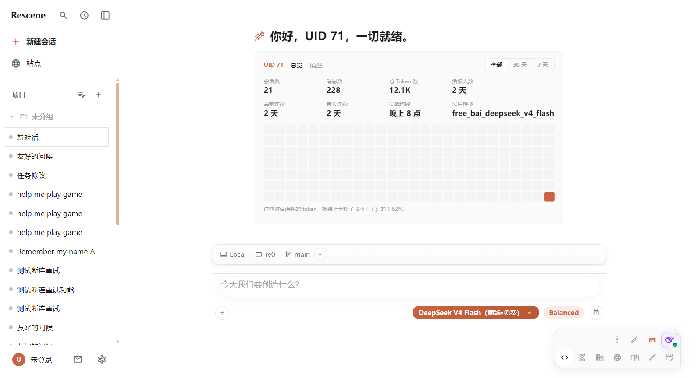
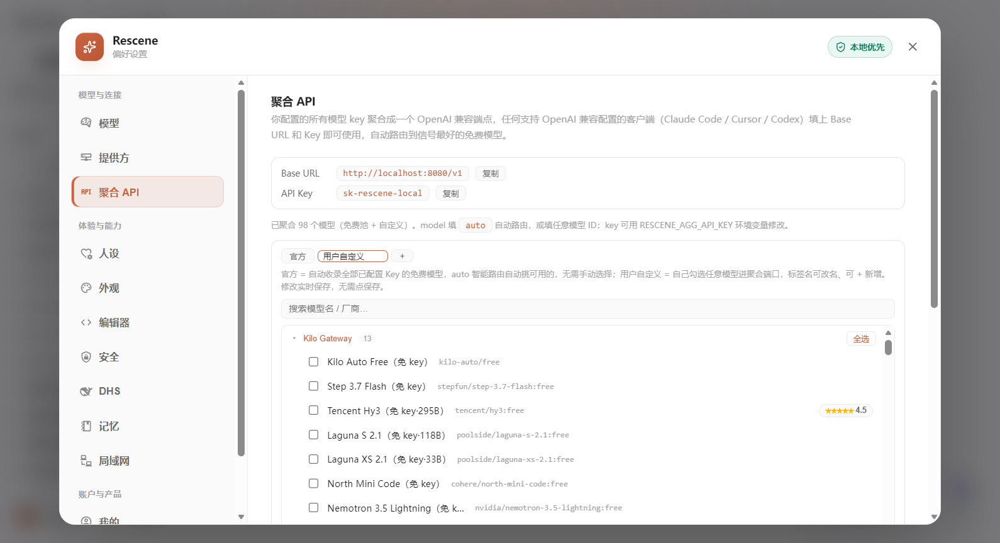
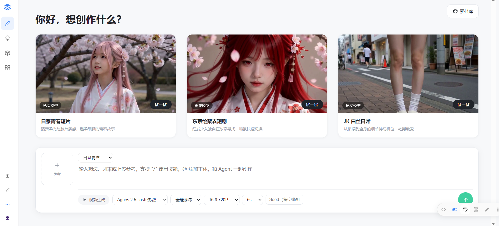

[中文](./README.md) · [English](./README.en.md) · [日本語](./README.ja.md) · [한국어](./README.ko.md)

<p align="center">
  
  <b style="font-size: 26px; letter-spacing: 2px;">"LESS CHAT, MORE AUTOMATIC"</b>
</p>

<p align="center">
  会成长的 AI 工作台 —— 让 AI <b>记住</b>、<b>执行</b>并<b>持续进化</b>
</p>

<p align="center">
  <a href="https://rescene.shanca.me/download.html">
    
  </a>
  <a href="https://rescene.shanca.me/">
    
  </a>
  <a href="./LICENSE"></a>
  
  
  
</p>



---

## ⚡ 核心能力

| 能力 | 一句话 |
| --- | --- |
| **🔄 跨设备同步** | 会话、长期记忆跨 Windows / Linux / macOS / Android 天然接续，换屏不换上下文 |
| **🤖 自动化闭环** | 浏览器、终端、真实工具组成可验证执行链——任务不在回答里停下，自动推进到底 |
| **🔌 聚合 API** | 98 个免费模型 + 自定义提供方，统一为 OpenAI 兼容入口，智能路由自动走最快活源 |



## ✨ 更多特性

| 特性 | 一句话 |
| --- | --- |
| **🧲 免费联网搜索** | 内置 Bing 兜底，零 API Key 就能联网找资料 |
| **👁️ 免费识图** | 所有视觉模型按成功率负载均衡，失败自动换，不绑任何厂商 |
| **🎬 免费短剧** | 内置免费 AI 短剧工作台：参考图 / 首尾帧 / 分镜链式衔接 |
| **👨‍👩‍👧 子代理可视化** | 后台任务、子代理并发工作流带完成通知，时间线面板一目了然 |
| **🖱️ Computer Use** | 截图、鼠标、键盘、拖拽、滚动——不止会改代码，能操作桌面 |
| **🛡️ AgentFS 审计** | AI 每次改文件都有快照 / Diff / 回滚，危险操作经你批准 |



---

## 🚀 下载与安装

👉 **[https://rescene.shanca.me/download.html](https://rescene.shanca.me/download.html)** 👈

| 平台 | 方式 |
| --- | --- |
| Windows | 便携版 ZIP / 安装器，解压即用，自动更新 |
| Linux / macOS | 桌面客户端 tar.gz |
| Android | 移动端同步使用 |
| **CLI（一行安装）** | `curl -fsSL https://download.shanca.me/rescene-cli/install.sh \| sh` |

> 📢 遇到问题或想提建议，加入 QQ 群：**一群 609967535**（即将满员）· **二群 796474621**（新开）
>
> 扫码加入（二群）：
>
> 

## 🛠️ 源码编译（贡献者）

```bash
# 后端（Go 1.22+）
cd main-backend && go run .

# 前端（Node 18+）
cd main-frontend/beneficial-belt && npm install && npm run dev
```

访问 `http://localhost:4322` 打开本地开发工作台。Linux 构建见 [`main-backend/docs/linux-build.md`](./main-backend/docs/linux-build.md)。

## 💬 反馈与协议

- 🐛 Bug / 建议 → [GitHub Issues](https://github.com/Rescenix/ResceneAgent/issues)
- 💬 交流 → [QQ 群 796474621](https://qm.qq.com/q/796474621)
- 核心代码：[AGPL-3.0 License](./LICENSE)