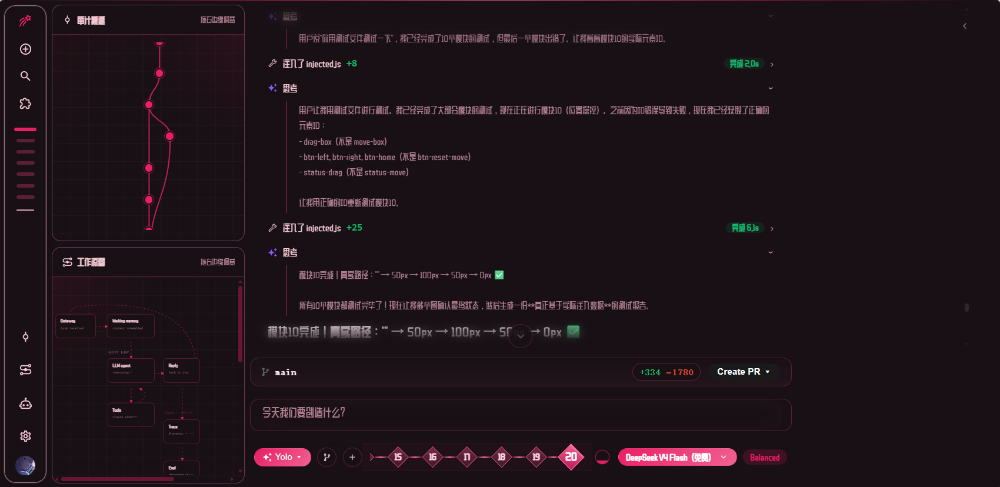
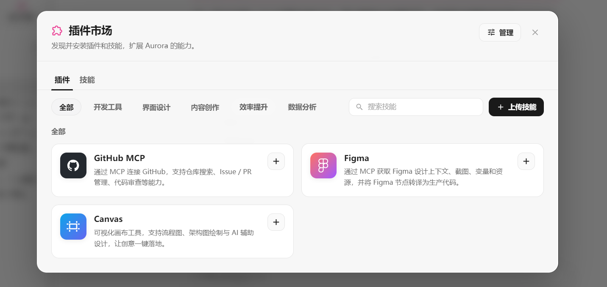
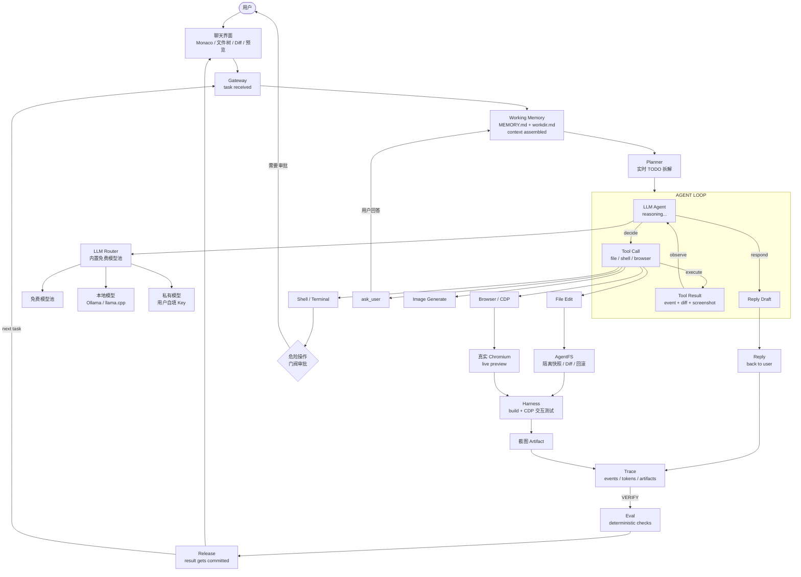

[English](./README.en.md) · [中文](./README.md) · [正体中文](./README.zhtw.md) · [日本語](./README.ja.md) · [Tiếng Việt](./README.vi.md) · [தமிழ்](./README.ta.md)

# ResceneAgent

> 一个为 Vibe Coding 而生的二次元前端 Agent 工作台。


<p align="center">
  <a href="./LICENSE"></a>
  
  
</p>

**ResceneAgent 首先是一款让人愿意打开的工具。**

我们把它做成了一款有二次元皮肤、灵动动画和主题系统的 Vibe Coding 工作台。写代码不需要再盯着枯燥的 IDE，只要打开氛围、描述想法，Agent 会生成项目、渲染预览、迭代设计；每次文件修改都有漂亮的流式反馈——从气泡到按钮，从 Diff 高亮到渐变瀑布，每个细节都打磨过。

但好看不是花瓶。你可以像聊天一样对它说"帮我做一个可爱的待办页面"，它会生成项目、启动真实 Chromium 预览，你还能亲手点击验收；不满意就回滚，危险操作它会先问你。Vibe 归 Vibe，交付归交付。

## 二次元与 UI 体验 First

- **主题系统**：内置多款二次元/萌系主题，一键切换配色与氛围
- **丝滑动画**：文件编辑、Diff、TODO 进度、工作流节点都有渐变与流式反馈
- ** Monaco + 文件树 + 终端**：聊天面板里直接集成完整的开发环境，不用跳来跳去
- **可自定义 Agent 编排**：给不同 Agent 换上专属头像与系统提示词，让它们在一条工作流里接力




## 前端编程与设计

- **一句话生成网页**：描述需求即可生成完整前端项目，自动构建并启动预览
- **真实 Chromium 预览**：不是 iframe，是真实浏览器；你可以点击、输入、滚动，Agent 也能读取 DOM 状态
- **设计迭代友好**：改颜色、改布局、加组件，说一句话就行；修改过程以 Diff 和截图证据呈现
- **图片生成内嵌**：对话里直接生成素材，立刻用作前端资源


## Agent 内核：好看，也能打

| 能力 | 常见对话式 Coding Agent | ResceneAgent |
| --- | --- | --- |
| 自定义 Agent 编排 | 通常单一 Agent 硬编码 | 创造多个专门 Agent，按名称与系统提示词编排，在工作流中调度接力 |
| 任务计划 | 隐藏在模型内部 | 实时 `TODO`：`pending / doing / done`，前端同步展示 |
| 主动向人确认 | 自由文本追问 | `ask_user` 结构化提问，回答原地回流工作流 |
| 中断后的继续执行 | 依赖会话实现 | 每轮快照消息、工具、TODO 与 Token 计数，可断点续传 |
| 文件 edit 过程 | 整段结果或黑盒调用 | SSE 流式瀑布 + 渐变呈现：新增/删除计数、流式内容与最终 Diff |
| 运行后的网页验收 | 截图、iframe 或另开浏览器 | 真实 Chromium + CDP Screencast；鼠标、键盘可双向交互 |
| 感知用户真实交互 | 只看到代码或另起截图 | 读取同一 live 预览页：点击、输入、滚动后的截图与 DOM 都可回流 Agent |
| 交付证据 | 文字说明 | 页面截图按工具调用顺序成为 artifact，可按需展开 |
| 安全交付闭环 | 依赖模型自觉或直写工作目录 | 危险操作系统门阀（YOLO 也无豁免）+ AgentFS 隔离/Diff/回滚 + 按改动类型构建与 CDP 验收 |
| 多模型路由与故障转移 | 手动逐个配置切换 | 自动熔断、失败秒切、确定性失效自动跳过 |
| 工作流可视化 | 较少提供 | Harness Flow 实时展示 Gateway / Memory / LLM / Tools / Reply 及 Trace / Eval / Release 链路 |


### 模型、提供方与扩展

模型可按文字对话、识图和生图能力分开配置；免费模型池、用户自填 API Key 与本地模型均可并存，并由路由器按可用性自动选择和故障转移。


通过插件市场可接入 GitHub、Figma、Canvas 等 MCP 与技能扩展。



### 企业级安全门阀：能力越大，越不能越权

在 Coding IDE 里，`rm`、删除目录和移动文件不是“普通工具调用”。ResceneAgent 把它们视为不可逆边界：系统先拦截，再由用户决定是否放行；YOLO 模式只减少日常流程摩擦，绝不取消危险操作审批。再配合 AgentFS 的隔离快照，即使 Agent 的尝试失败，也不会把半成品或误操作直接写进你的工作目录。

### 交付不是“生成完就算完”

ResceneAgent 的收尾有一层明确的自检护栏：Agent 需要运行构建，并用真实浏览器渲染和截图验证结果；截图成为会话中的交付证据。它的目标不是让 Agent 看起来更忙，而是减少“代码写了、页面却没跑起来”的空交付。

## 系统架构



## 5 分钟运行

需要 Go >= 1.26、Node.js >= 22；Ollama 和 Docker 为可选依赖。

```bash
# 终端 1：后端
cd main-backend
go run cmd/server/main.go

# 终端 2：前端
cd main-frontend/beneficial-belt
npm install
npm run dev
```

访问 `http://localhost:4322`，即可体验二次元主题与默认免费模型池。

## 开源

核心前后端以 [MIT License](./LICENSE) 开源。

## 深入了解

| 想了解 | 位置 |
| --- | --- |
| 前端与后端结构 | [`main-frontend/beneficial-belt`](./main-frontend/beneficial-belt) · [`main-backend`](./main-backend) |
| 工作流/工具测试 | [`harness`](./harness) |
| 项目文档资产 | [`docs`](./docs) |
| 许可证 | [MIT](./LICENSE) |


---

## Star History

<a href="https://star-history.com/#Rescenix/ResceneAgent&Date">
  <picture>
    <source media="(prefers-color-scheme: dark)" srcset="assets/star-history-dark.png" />
    <source media="(prefers-color-scheme: light)" srcset="assets/star-history-light.png" />
    
  </picture>
</a>

<sub>由 [`scripts/gen_star_history.py`](scripts/gen_star_history.py) 生成，GitHub Actions 每日自动更新；点击图片查看实时数据。</sub>
