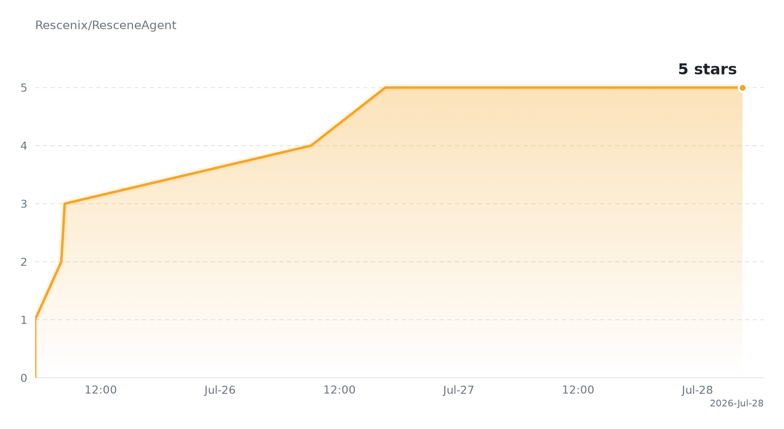

[English](./README.en.md) · [中文](./README.md) · [正体中文](./README.zhtw.md) · [日本語](./README.ja.md) · [Tiếng Việt](./README.vi.md) · [தமிழ்](./README.ta.md)

# ResceneAgent

**本地运行，免费 3S 极速生图识图，无限 Token**

> 前端特化的多智能体作战平台 —— 把 IDE、终端、浏览器和一支 AI 团队，塞进同一个对话框。以数字生命「Aurora」为核心，从需求拆解 → 代码落地 → 运行验证，闭环在聊天框里完成。

<p align="center">
  <a href="./LICENSE"></a>
  = 1.26">
  = 22">
  
</p>

**不止会聊，更会写、会跑、会验。**

**全球首发互动交互 Agent** —— 在聊天面板里直接操作 Agent 渲染出的真实页面：鼠标、键盘经 CDP 双向打进同一个 headless Chromium，你能在预览窗口里亲手玩 Agent 造的网页游戏、填它写的表单，而不只是看截图。

### 一眼看懂 ResceneAgent

- **代码生成过程本身就是 UI** —— 模型写文件时，代码以 SSE 流式瀑布实时出现，长文件持续生成也无需等待整段工具调用结束；新增/删除行、生成进度与最终 Diff 在同一条工作流里自然衔接。
- **聊天面板即浏览器操作台** —— 预览窗口不是静态截图，而是真实可交互的 Chromium：Agent 改完 HTML，你直接用鼠标点击、键盘输入去驱动它渲染的页面，双向交互由后端 CDP 中继闭环。
- **边生成，边编辑，边预览** —— 文件写入后立即进入 Monaco 与可审计 Diff；前端页面由真实 Chromium 自动刷新渲染，把“描述需求 → 修改文件 → 看见页面”压缩在一个聊天面板中。
- **对话内原生 AI 生图** —— Agent 可直接调用文生图工具，生成结果作为图片工件嵌入消息流，可继续用于页面、游戏和视觉内容制作，无需跳出工作区搬运素材。
- **每次修改都有时光机** —— AgentFS 为会话建立独立分支与快照树，支持逐节点审计、Diff 查看、分支探索和回退，不把 AI 的试错直接变成主仓库里的脏改动。
- **不是单 Agent 套壳** —— 实时 TODO、结构化追问、断点续传、多 Agent 调度、终端执行和浏览器验收共同组成完整交付链路。

---

## 为什么不一样

通用编码助手能聊代码，ResceneAgent 把"写、跑、验"做成了带护栏的闭环。两层差异化设计是平台的护城河：

### AgentFS：给 AI 的写操作加上「事务」

AI 联动改十个文件，改到第五个崩了，前四个已脏写进硬盘——这是传统 AI 编程最致命的弱点。ResceneAgent 把文件写操作重构成一条**带隔离、可审计、可回退的事务层**：

- **内存快照隔离** —— 每次改动先落入隔离快照，不立即污染你的项目；
- **原子提交 / 回滚** —— 经编译、测试、人工确认后才刷入磁盘；失败则整体回退，项目完好如初；
- **像素级审计时间线** —— 每一行修改带操作来源，可逐条 Approve / Reject；
- **时间旅行** —— 沿快照时间线回跳，定位"哪一版还能编译通过"。

思想根基源自 VFS、Git 与数据库事务等成熟范式；真正的差异是把这套能力**系统性地做成了面向 AI Agent 的独立写操作事务层**。

### 记忆 / 状态双轨：让 Agent 不再失业

每次开新会话都从零开始？ResceneAgent 把跨对话记忆与跨项目状态做成**面向 Agent 的独立记忆层**：

- **全局 `MEMORY.md` + 项目级 `workdir.md`** 双轨，物理隔离在 `~/rescene_data/`，不污染你的仓库；
- **Agent 主动写入** —— 通过工具决定"什么值得记住"，只有用户选择记住的才落盘；
- **会话开始自动注入** —— 工作流启动时无条件拼进系统提示词，Agent 一开口就了解项目历史。

---

## 特性

### 差异化能力

- **SSE 代码瀑布：看得见的文件生成** —— 写文件参数不再是黑盒等待：新增/删除计数实时更新，代码流平滑进入固定视窗，长文件完成后无缝切换为完整 Diff，避免一次性渲染巨量文本卡死页面。
- **对话内原生 AI 生图** —— `image_generate` 根据提示词生成图片，并以原生图片 artifact 插入对应工具步骤；生成、查看与继续用于前端素材都留在同一上下文中。
- **AgentFS Trace：会话级 Git 痕迹树** —— 侧栏展示可分叉的快照树，一会话一轨迹；点击节点查看玻璃质感 Diff 卡片，可从任意快照创建探索分支。所有轨迹来自隔离影子 Git 仓库，不向主仓库写额外提交。
- **Harness Flow：实时工作流架构图** —— 聊天右侧内嵌画布，把 Gateway / Memory / LLM / Tools / Reply 及 Trace / Eval / Release 阶段串成真实事件驱动的流动图，当前链路高亮。
- **Agent 主动 TODO** —— 复杂任务开始即发布 `pending / doing / done` 结构化清单，SSE 推送到输入框上方，跨上下文压缩不丢计划、断点可恢复。
- **主动向用户提问（Human-in-the-loop）** —— `ask_user` 在工作流现场发起结构化决策（单选/多选/自由输入），回答作为正式上下文原地续跑，绝不擅自猜测。
- **断点续传** —— 每轮自动快照（消息历史、工具、TODO、Token 计数），重启或断网后前端展示恢复条，从断点轮次重放。
- **实时渲染调试浏览器** —— Agent 改完前端文件，真实 Chromium（CDP）自动渲染并 Screencast 回面板，非 iframe；带导航/移动端视口/外部打开。
- **截图工件** —— 页面截图作为 artifact 按工具调用顺序插入聊天流，默认折叠、按需展开，Agent 自主交付页面证据。
- **企业级安全与校验** —— ① 不可逆操作（删文件/目录/移动）零豁免审批，YOLO 模式也不放行；② 收尾强制构建 + 截图校验门（`go build` / `npm run build` + 真实渲染截图），作为加分项推回前端。

### 通用 IDE 体验（集成于聊天面板）

内嵌真实 PowerShell 终端（脚本片段面板）、Monaco 编辑器 + 递归文件树、VS Code 风格 Diff 预览、SSE 流式代码瀑布、对话内 AI 生图、消息渐变动画，以及覆盖全 UI 的二次元皮肤系统（含 Live2D 看板娘）。此外还内置博客/CMS、电子书、图床、TTS、统计仪表盘等模块。

---

## 系统架构

```
┌──────────────────────────────────────────────────────────────┐
│   beneficial-belt (Astro + Vue 3 + Naive UI)                    │
│   聊天 · 编辑器 · 文件树 · 终端 · 预览浏览器 · Diff · 皮肤系统     │
│   └─ 设置页：用户自由填写 LLM 提供方 / API Key / 模型（非硬编码）  │
├──────────────────────────────────────────────────────────────┤
│   main-backend (Go / Gin :8080)                                 │
│   四态机工作流 · 多Agent调度 · 实时TODO · 主动提问 · MCP · 记忆    │
│   └─ 多提供方模型路由：按配置动态转发，无内置/硬编码 LLM 后端      │
├──────────────────────────────────────────────────────────────┤
│   AgentFS：会话级快照树 · 影子 Git · Diff 审计 · 时间旅行          │
├──────────────────────────────────────────────────────────────┤
│   记忆层：MEMORY.md(全局) + workdir.md(项目级)，单文件落盘         │
├──────────────────────────────────────────────────────────────┤
│   外部 LLM 云 API（用户自选：Ollama / DeepSeek / Gemini / …）     │
└──────────────────────────────────────────────────────────────┘
```

> LLM 不是平台后端的一部分：提供方、API Key 与具体模型都由用户在**前端设置页自由配置**，后端只做动态路由与故障转移，不内置、不硬编码任何一家。

## 仓库结构

```
re0/
├── main-backend/          # Go 后端服务 (:8080)
│   ├── internal/handler/  # 工作流 / AgentFS / 预览 / 终端 / MCP / 技能 / 子Agent
│   ├── skills/            # 学习到的技能（本地获取，不入库）
│   └── mcp/               # 自研 MCP server（grep/shell/memory…）
├── main-frontend/beneficial-belt/   # Astro + Vue 3 前端
├── harness/               # Python 脚本（MCP/测试/工具）
└── docs/                  # 文档资产
```

## 快速开始

### 前置依赖

- Go >= 1.26
- Node.js >= 22
- Ollama（本地 LLM，可选）
- Docker（代码沙箱，可选）

### 后端

```bash
cd main-backend
# 配置 .env（ADMIN_PASSWORD, JWT_SECRET, DEEPSEEK_API_KEY 等）
go run cmd/server/main.go
```

### 前端

```bash
cd main-frontend/beneficial-belt
npm install
npm run dev    # http://localhost:4322
```

记忆层随后端启动自动生效，无需单独部署。

## 环境变量

| 变量 | 说明 |
|------|------|
| `ADMIN_PASSWORD` | 管理员密码（SHA-256 摘要比对，无明文存储、无后门） |
| `DEEPSEEK_API_KEY` | DeepSeek API Key |
| `MCP_CONFIG` | MCP server 配置文件路径（默认 `./mcp.json`） |
| `RESCENE_DATA_DIR` | 记忆 / AgentFS / 会话数据根目录（默认 `~/rescene_data`） |

## 许可证

本项目基于 [MIT License](./LICENSE) 开源。

---

## Star History

<a href="https://star-history.com/#Rescenix/ResceneAgent&Date">
  <picture>
    <source media="(prefers-color-scheme: dark)" srcset="assets/star-history-dark.png" />
    <source media="(prefers-color-scheme: light)" srcset="assets/star-history-light.png" />
    
  </picture>
</a>

<sub>由 [`scripts/gen_star_history.py`](scripts/gen_star_history.py) 生成，GitHub Actions 每日自动更新；点击图片查看实时数据。</sub>
---
