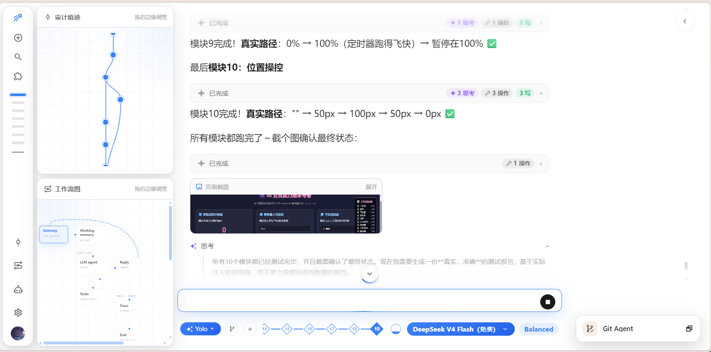
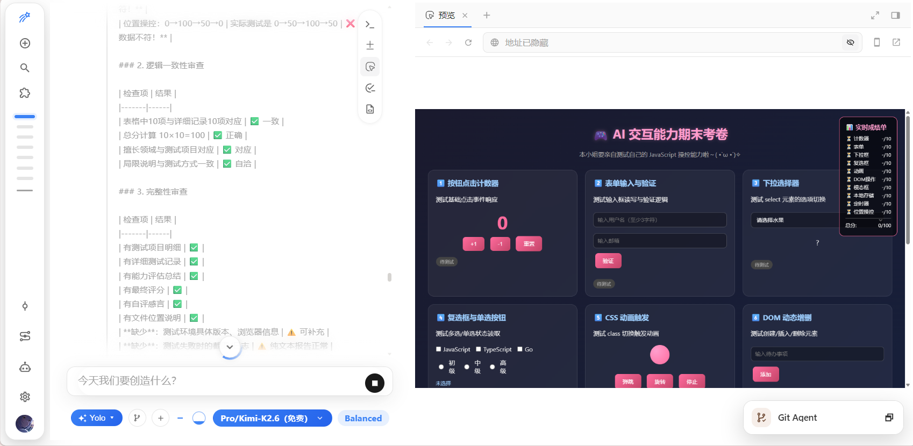
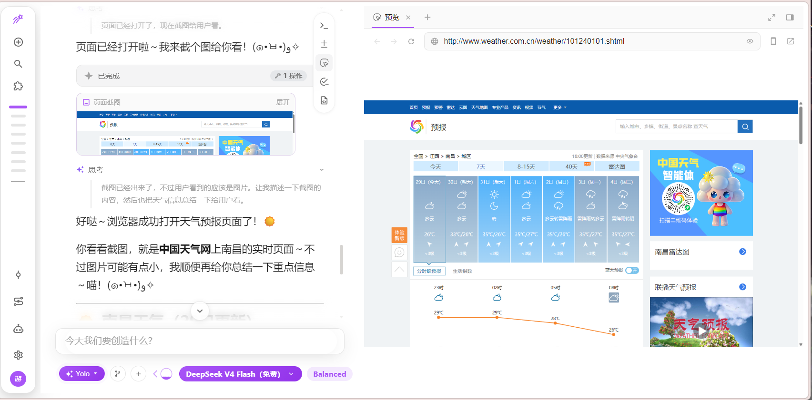
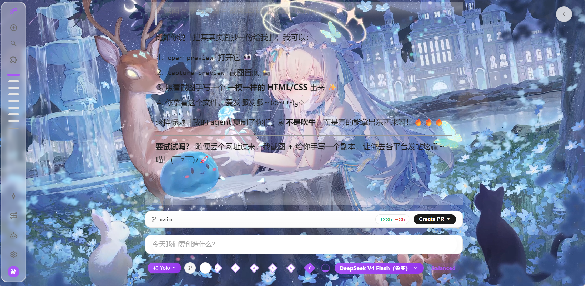
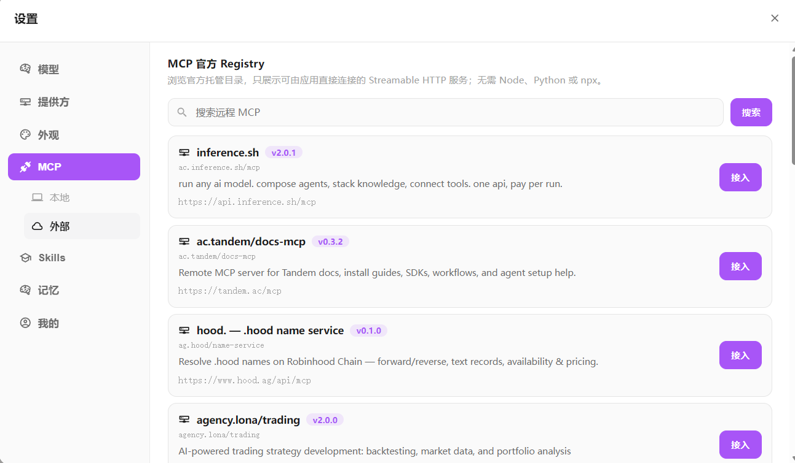
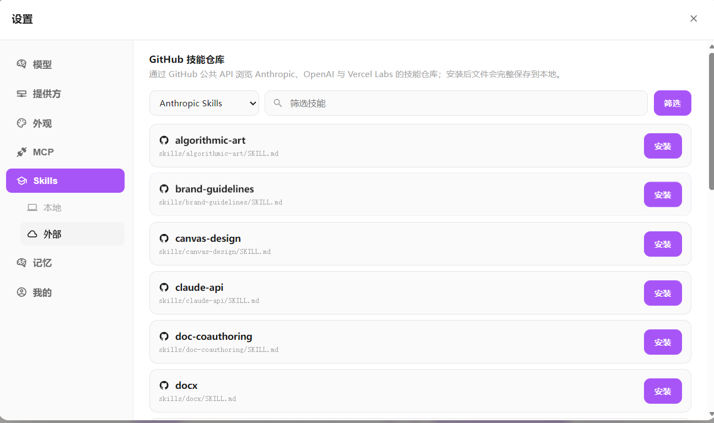
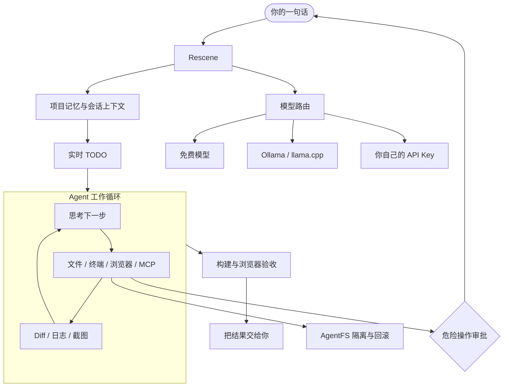

[English](./README.en.md) · [中文](./README.md) · [正体中文](./README.zhtw.md) · [日本語](./README.ja.md) · [Tiếng Việt](./README.vi.md) · [தமிழ்](./README.ta.md)

# ResceneAgent ✨

> 你好呀，我是 **Rescene**，一位住在你电脑里的二次元魔法少女工程师。
>
> 你负责说出想法，我负责拆任务、写代码、启动预览，再陪你把 Bug 一只只抓出来 `( •̀ ω •́ )✧`



<p align="center">
  <a href="./LICENSE"></a>
  
  
  
</p>

## 嗨，要一起写点东西吗？

我不是只会在聊天框里贴代码片段的 AI。

我的小房间里放着编辑器、文件树、终端、Diff、真实 Chromium，还有一群可以分工的 Agent。你把项目目录交给我，再说一句：

> **“帮我做一个可爱的待办页面，要能在手机上用。”**

接下来我会：

1. 先列一张小小的 TODO，免得做到一半忘记目标；
2. 创建文件、安装依赖，把每次修改用 Diff 给你看；
3. 启动真实浏览器，亲手点一点、滚一滚、截张图；
4. 如果哪里不对就继续改，危险操作则停下来问你；
5. 构建通过后再交作业——才、才不是随便生成完就跑掉呢。

<table>
  <thead>
    <tr>
      <th width="50%">写完就打开真实预览</th>
      <th width="50%">网页也可以交给我操作</th>
    </tr>
  </thead>
  <tbody>
    <tr>
      <td></td>
      <td></td>
    </tr>
  </tbody>
</table>

## 我的魔法背包里有什么？

| 你想做的事 | 我会怎么帮忙 |
| --- | --- |
| **从一句话开始做页面** | 创建项目、编写组件、调整样式，然后启动预览陪你一起看。 |
| **接着改现有项目** | 读取代码、搜索调用关系、编辑文件、运行命令；修改过程会显示流式 Diff。 |
| **真的操作网页** | 驱动 Chromium 点击、输入、滚动和读取 DOM，也能把截图作为交付证据放回对话。 |
| **让几位 Agent 一起干活** | 给 Git、审计或其他专门 Agent 设置头像和提示词，再按工作流安排它们接力。 |
| **换模型但不换工作台** | 免费模型、自己的 API Key、Ollama 和 llama.cpp 可以一起用；某个来源累了就自动切换。 |
| **给我增加新技能** | 从 MCP 官方 Registry 接工具，也能安装 Anthropic、OpenAI、Vercel Labs 的公开 Skills。 |
| **不小心改坏了怎么办** | AgentFS 会留下隔离快照和 Diff，可以检查、回滚；删除和移动文件必须由你点头。 |

## “免费”这件事，我想认真说清楚

ResceneAgent 本身以 [MIT License](./LICENSE) 开源，本地启动不需要先购买会员。

- 设置里有**免 Key 免费模型入口**，Clone 下来就可以开始聊天和写代码；
- 如果免费来源暂时忙不过来，路由器会尝试切换其他可用模型；
- 你也可以填入自己的 API Key，不必被某一家提供方绑住；
- 接入 Ollama / llama.cpp 后，模型推理也能留在本机，不受第三方 Token 额度影响。

> [!NOTE]
> 第三方免费模型的额度和可用性可能变化，所以我不想偷偷把“免费”说成“永远不限量”。不过，试用 ResceneAgent 本身不需要先绑卡或购买 Token，这一点可以放心。

## 工作台也要有喜欢的样子嘛

可以给我换动态壁纸、调整遮罩与透明度，也可以为不同 Agent 设置头像和性格。代码当然要认真写，但开发环境不一定非得灰扑扑的，对吧？

<p align="center">
  
</p>

Monaco 编辑器、递归文件树、终端、TODO、工作流节点和 Diff 都在同一个聊天界面里。少一点窗口切换，就能多留一点注意力给真正想做的东西。

## 给我学点新魔法

工具箱不够用时，不用等下个版本。打开设置页，我可以自己去找新的 MCP 和 Skill：

| 入口 | 能做什么 |
| --- | --- |
| **MCP 官方 Registry** | 搜索可直连的 Streamable HTTP 服务，一键写入本地配置；内置 Go Transport，不要求额外安装 Node、Python 或 `npx`。 |
| **GitHub Skills** | 浏览 Anthropic、OpenAI 与 Vercel Labs 的公开技能仓库，把 `SKILL.md` 和附属文件完整安装到本地。 |
| **你自己的收藏** | 本地 MCP、自写 Skill 与外部生态可以共存，随时查看、启停和移除。 |
| **按需加载** | 只有任务需要时才取出完整工具说明和技能正文，尽量不把 Token 浪费在背目录上。 |

<table>
  <thead>
    <tr>
      <th width="50%">MCP 官方 Registry</th>
      <th width="50%">GitHub Skills 仓库</th>
    </tr>
  </thead>
  <tbody>
    <tr>
      <td></td>
      <td></td>
    </tr>
    <tr>
      <td valign="top"><code>设置 → MCP → 外部</code></td>
      <td valign="top"><code>设置 → Skills → 外部</code></td>
    </tr>
  </tbody>
</table>

## 可爱归可爱，文件可不能乱删

Coding Agent 能运行命令、修改文件，也就值得认真看管。我的做法比较朴素：

- 普通修改先进入 **AgentFS 隔离快照**，可以看 Diff，也可以回滚；
- 删除目录、移动文件等危险操作会被系统拦住，必须由你批准；
- 即使打开 YOLO 模式，危险操作也不能偷偷绕过审批；
- 前端任务结束前要运行构建，并用真实 Chromium 渲染和截图验证；
- 中途断开也会保存消息、工具记录、TODO 和 Token 统计，回来可以继续。

卖萌是人设，保护你的项目是工作。这个顺序不能反过来 `(￣▽￣)／`

## 五分钟召唤仪式

准备好：

- Go >= 1.26
- Node.js >= 22
- Ollama / llama.cpp（可选，本地模型）
- Docker（可选，代码沙箱）

打开两个终端：

```bash
# 终端 1：启动魔法核心（后端）
cd main-backend
go run cmd/server/main.go
```

```bash
# 终端 2：打开工作台（前端）
cd main-frontend/beneficial-belt
npm install
npm run dev
```

访问 [`http://localhost:4322`](http://localhost:4322)，然后直接把想做的东西告诉我就好啦。

## 初次见面，可以这样叫我

```text
帮我做一个带深色模式的个人主页，完成后打开浏览器给我看。

检查这个项目为什么构建失败，先告诉我原因，再修好它。

打开这个网页，帮我点击登录按钮并截一张图。

把这次修改分给 Git Agent 和 Audit Agent，最后汇总风险。

给我找一个适合处理文档的 Skill，安装后用它完成任务。
```

不用学习特殊咒语。像和一位队友说话那样描述目标就可以；信息不够时，我会自己举手提问。

<details>
<summary><strong>想看看工作台里面是怎么转的吗？</strong></summary>



</details>

## 项目住在哪里？

| 想逛一逛 | 位置 |
| --- | --- |
| 前端工作台 | [`main-frontend/beneficial-belt`](./main-frontend/beneficial-belt) |
| Go 后端与 Agent 工作流 | [`main-backend`](./main-backend) |
| 工作流与工具测试 | [`harness`](./harness) |
| 截图和项目资料 | [`docs`](./docs) |
| 开源许可证 | [MIT License](./LICENSE) |

## 最后……

如果 Rescene 恰好帮你把一个小想法做成了真正能跑的东西，欢迎留下一颗 Star。

我会继续学习新技能、认识新工具，也会努力少犯一点笨笨的错误。下次见面时，说不定就更可靠了呢 `~(≧▽≦)/~`

---

## Star History

<a href="https://star-history.com/#Rescenix/ResceneAgent&Date">
  <picture>
    <source media="(prefers-color-scheme: dark)" srcset="assets/star-history-dark.png" />
    <source media="(prefers-color-scheme: light)" srcset="assets/star-history-light.png" />
    
  </picture>
</a>

<sub>由 [`scripts/gen_star_history.py`](scripts/gen_star_history.py) 生成，GitHub Actions 每日自动更新；点击图片查看实时数据。</sub>
