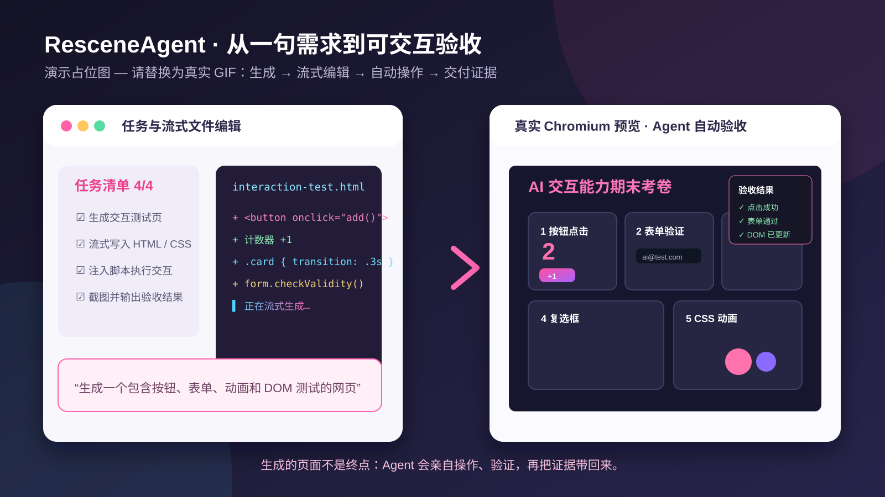
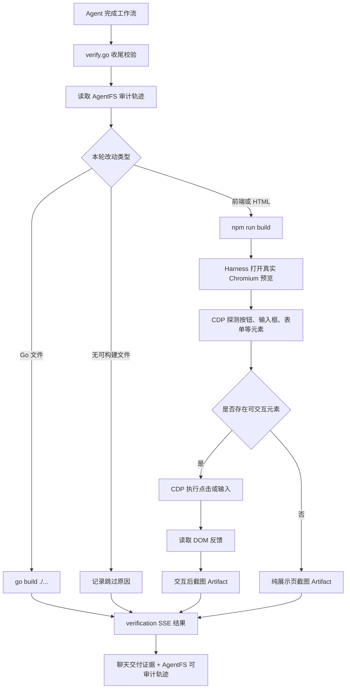

[English](./README.en.md) · [中文](./README.md) · [正体中文](./README.zhtw.md) · [日本語](./README.ja.md) · [Tiếng Việt](./README.vi.md) · [தமிழ்](./README.ta.md)

# ResceneAgent 开箱可用无需Key

> 前端交付最慢的部分不是写代码，是“写完后手动跑起来、逐屏验收、再改再验”。

ResceneAgent 是面向前端工程团队的本地 Agent 工作台：一句需求，多 Agent 协同拆解任务、生成代码、运行构建、启动真实 Chromium 预览，并把验收截图与 Diff 证据写回同一条对话流。你还可以创造并编排自己的专门 Agent——Git 审查、测试、文档、合规检查——让它们在一条工作流里接力。所有改动先进入 AgentFS 隔离快照，危险操作经系统门阀审批，不满意可一键回滚：它不是生成片段的玩具，而是把前端交付闭环搬进聊天框的生产力系统。

<p align="center">
  <a href="./LICENSE"></a>
  
  
</p>

## 先看它如何交付



> **演示占位图**：这里将替换为真实 GIF。它展示的不是手工搭好的页面，而是 Agent 根据一句需求**一键生成**的交互测试站点；文件编辑在对话中以流式瀑布和渐变实时显现，随后 Agent 打开真实预览、亲自操作页面，并把验收结果写回任务流。

```text
一句需求
  → 子 Agent 拆解任务，实时 TODO 可见
  → 文件 edit 以 SSE 流式瀑布生成，新增/删除与最终 Diff 可审计
  → 一键生成并启动完整交互网站
  → Agent 通过真实 Chromium / CDP 点击、输入、触发 DOM 与 CSS 交互
  → 构建、截图与验收结果成为交付证据；不满意可回滚
```

## 能力对照

ResceneAgent 不只是“AI 写完给你一段代码”。你对它说"做个能联机的贪吃蛇"，它会生成项目、启动真实 Chromium 预览，让你亲自点击、输入并根据用户网页交互改进、验收；模型、提供方和 API Key 完全由你配置存储本地，开源后端只做免费Agent模型动态路由。

下表逐项对比常见能力：

| 能力 | 常见对话式 Coding Agent | ResceneAgent |
| --- | --- | --- |
| 自定义 Agent 编排 | 通常单一 Agent 硬编码 | 创造多个专门 Agent，按名称与系统提示词编排，在工作流中调度接力 |
| 任务计划 | 隐藏在模型内部 | 实时 `TODO`：`pending / doing / done`，前端同步展示 |
| 主动向人确认 | 自由文本追问 | `ask_user` 结构化提问，回答原地回流工作流 |
| 中断后的继续执行 | 依赖会话实现 | 每轮快照消息、工具、TODO 与 Token 计数，可断点续传 |
| 文件 edit 过程 | 整段结果或黑盒调用 | SSE 流式瀑布 + 渐变呈现：新增/删除计数、流式内容与最终 Diff |
| 编辑、终端与 Diff | 依赖外部 IDE | Monaco、文件树、PowerShell、可审计 Diff 集成在聊天面板 |
| 运行后的网页验收 | 截图、iframe 或另开浏览器 | 真实 Chromium + CDP Screencast；鼠标、键盘可双向交互 |
| 感知用户真实交互 | 只看到代码或另起截图 | 读取同一 live 预览页：点击、输入、滚动后的截图与 DOM 都可回流 Agent |
| 交付证据 | 文字说明 | 页面截图按工具调用顺序成为 artifact，可按需展开 |
| 安全交付闭环 | 依赖模型自觉或直写工作目录 | 危险操作系统门阀（YOLO 也无豁免）+ AgentFS 隔离/Diff/回滚 + 按改动类型构建与 CDP 验收 |
| 长期上下文 | 依赖会话或外部记忆 | 全局 `MEMORY.md` + 项目 `workdir.md` 双轨隔离，不污染仓库 |
| 多模型路由与故障转移 | 手动逐个配置切换 | 自动熔断、失败秒切、确定性失效自动跳过 |
| 工作流可视化 | 较少提供 | Harness Flow 实时展示 Gateway / Memory / LLM / Tools / Reply 及 Trace / Eval / Release 链路 |

### 企业级安全门阀：能力越大，越不能越权

在 Coding IDE 里，`rm`、删除目录和移动文件不是“普通工具调用”。ResceneAgent 把它们视为不可逆边界：系统先拦截，再由用户决定是否放行；YOLO 模式只减少日常流程摩擦，绝不取消危险操作审批。再配合 AgentFS 的隔离快照，即使 Agent 的尝试失败，也不会把半成品或误操作直接写进你的工作目录。

### 交付不是“生成完就算完”

ResceneAgent 的收尾有一层明确的自检护栏：Agent 需要运行构建，并用真实浏览器渲染和截图验证结果；截图成为会话中的交付证据。它的目标不是让 Agent 看起来更忙，而是减少“代码写了、页面却没跑起来”的空交付。

### Harness：按改动类型自适应验收

收尾校验只在 Agent 准备结束工作流时运行一次，不在每个步骤反复打断工作。它读取 AgentFS 审计轨迹，按本轮实际改动决定验证路径：改 Go 才构建 Go，改前端才构建前端；前端页面含可交互元素时，才在同一份真实 Chromium 预览中执行点击、输入并读取 DOM 反馈。纯展示页不会被强行执行交互测试。



> 交互验证失败、构建失败或本机依赖缺失都会被记录在验收结果中，但不会粗暴阻断对话收尾；用户能看到证据与状态，再决定下一步。

### AgentFS：让 AI 的改动可控、可回退

每个会话都有自己的快照轨迹：文件修改先进入隔离的影子 Git 仓库，而不是立刻污染项目。你可以查看每次 Diff、回到之前能正常工作的节点，或从任意快照拉出探索分支。

## 5 分钟运行

需要 Go >= 1.26、Node.js >= 22；Ollama 和 Docker 为可选依赖。

```bash
# 终端 1：后端
cd main-backend
go run cmd/server/main.go

# 终端 2：前端
cd main-frontend/beneficial-belt
npm install
npm run dev
```

访问 `http://localhost:4322`，再在设置中填写你自己的 LLM 提供方、模型与 API Key。

## 开源

核心前后端以 [MIT License](./LICENSE) 开源

## 深入了解

| 想了解 | 位置 |
| --- | --- |
| 前端与后端结构 | [`main-frontend/beneficial-belt`](./main-frontend/beneficial-belt) · [`main-backend`](./main-backend) |
| 工作流/工具测试 | [`harness`](./harness) |
| 项目文档资产 | [`docs`](./docs) |
| 许可证 | [MIT](./LICENSE) |

如果这个方向让你对“AI 不是只会聊天，而是能交付的东西”多一点期待，欢迎点一个 Star。

---

## Star History

<a href="https://star-history.com/#Rescenix/ResceneAgent&Date">
  <picture>
    <source media="(prefers-color-scheme: dark)" srcset="assets/star-history-dark.png" />
    <source media="(prefers-color-scheme: light)" srcset="assets/star-history-light.png" />
    
  </picture>
</a>

<sub>由 [`scripts/gen_star_history.py`](scripts/gen_star_history.py) 生成，GitHub Actions 每日自动更新；点击图片查看实时数据。</sub>
