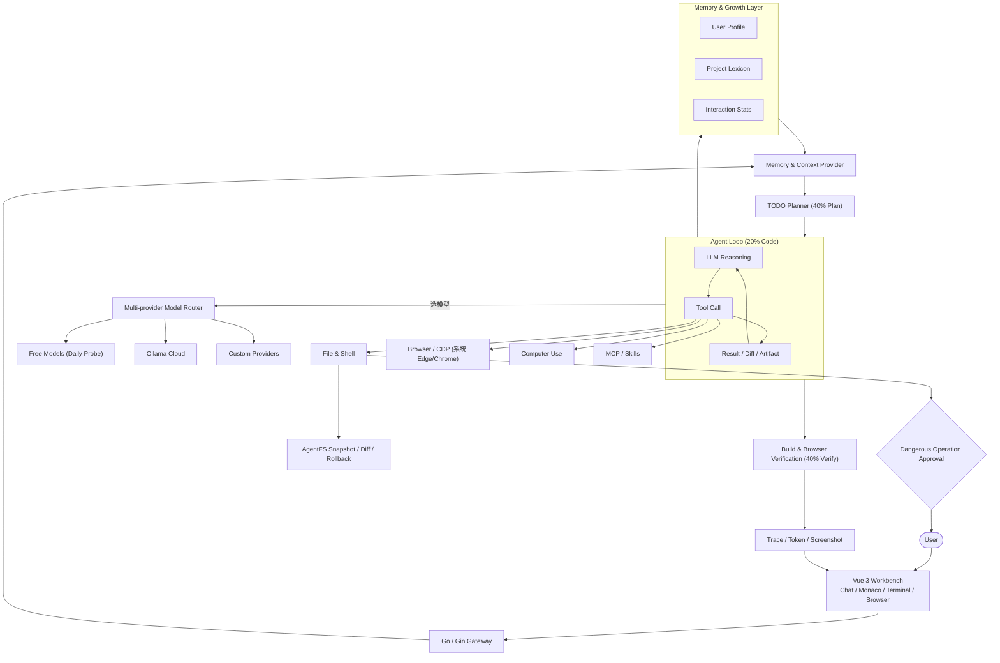

[中文](./README.md)

# Rescene 🧬

> 专攻**前端设计**、**浏览器自动化**、**Computer Use** 的二次元 Agent。
> 每日自动更新可用的免费模型。

付费 Agent 太贵，免费的总在限流？那就自己写一个。

<p align="center">
  <a href="./LICENSE"></a>
  
  
  
  
</p>

<p align="center">
  🔒 所有数据存本地，不上云 · 💰 永久免费 · 🪶 轻量 Agent（发行包约 10M，不内置浏览器） · 📦 解压即用 · 🪟 Windows 10+
</p>

---

## ⚡ 核心能力

| 能力 | 说明 |
| --- | --- |
| **🎨 专攻前端设计** | 内置 54 个真实设计系统参考（Linear / Vercel / Stripe / Notion...），按任务类型自动匹配风格——仪表盘用 Linear 极简风，落地页用 Stripe 优雅风。Agent 写完直接真实渲染给你看 |
| **🌐 真实浏览器自动化** | 复用系统 Edge/Chrome 与 CDP：真实渲染、点击、输入、滚动、DOM 读取、截图、双向交互验证。不是截图假装，是真浏览器在跑你的页面 |
| **🖱️ Computer Use** | 不止会改代码——能操作桌面：截图、移动鼠标、点击、键入、拖拽、滚动，接管整台机器干活 |
| **🔋 免费模型每日更新** | 每天自动探测各厂商免费档模型可用性，跑不了的自动标记退役，能用的自动恢复——免费池永远是真能跑的 |
| **🧠 成长中的记忆** | 每次工作流完成后自动萃取经验：模型偏好、技术栈倾向、代码风格、项目架构，下次自动融入上下文，不需要写自定义指令 |
| **🔧 4+4+2 Agent 工作流** | 40% 计划 → 40% 验证 → 20% 编码，实时 TODO 编排、多轮工具调用、中断恢复、全链路交付验证 |
| **💻 集成工作台** | 聊天界面内嵌 Monaco 编辑器、递归文件树、终端、流式 Diff、浏览器预览面板 |
| **🔌 零依赖 MCP 扩展** | 纯 Go 实现的 MCP 客户端，跑远程 MCP 服务不需要在本地装 Node / Python / npx |
| **🛡️ AgentFS 变更审计** | 快照 / Diff / 回滚管理 AI 文件修改，危险操作必须经用户批准 |

---

## 🧭 4 + 4 + 2 原则

Rescene 的 Agent 工作流严格遵守 **4+4+2 原则**：

| 阶段 | 占比 | 说明 |
| --- | --- | --- |
| **🗺️ 明确需求与计划** | **40%** | 成败在写第一行代码前就决定了。结构化 TODO、任务中断恢复、上下文精准对齐。 |
| **✅ 真实执行与验证** | **40%** | 代码能不能编译？页面跑起来长什么样？真实浏览器自动化（复用系统 Edge/Chrome）+ Computer Use 实测，拒绝没有实测验证的纸上谈兵。 |
| **💻 纯编码** | **20%** | 静态代码片段只占两成。AI 必须长出手脚，自己去跑编译、自己去点页面、自己去操作桌面。 |

---

## 🌱 发育轨迹

Rescene 不是一开始就全知的。它随时间成长：

| 相处时间 | 它了解你什么 |
|----------|------------|
| 第一次对话 | 只知道你给的任务 |
| 完成几个工作流 | 知道你常用什么模型、任务习惯多长 |
| 修改过它生成的代码 | 知道你的代码风格偏好 |
| 审批过危险操作 | 知道你对哪些工具放心 |
| 长期协作 | 知道你的项目架构、常用模式、领域术语 |

它通过每一次真实的协作了解你，而不是你"告诉"它。

---

## 🔄 从生成代码到验证结果

一次典型的前端任务会经过：

1. 根据用户目标创建结构化 TODO
2. 搜索项目上下文并修改文件
3. 运行依赖安装、构建或测试命令
4. 启动真实浏览器预览（复用系统 Edge/Chrome），Agent 自行决定何时截图交付
5. 将 Diff、日志、截图作为交付证据返回

---

## 系统架构



---

## 技术栈

| 层级 | 技术 |
| --- | --- |
| **💻 前端** | Vue 3、Vite、Naive UI、Monaco Editor、GSAP、PixiJS |
| **⚙️ 后端** | Go 1.26、Gin、WebSocket、SSE（纯原生工具解析与路由） |
| **🌐 浏览器** | 复用系统 Edge/Chrome（不内置浏览器，发行包更轻）、Chrome DevTools Protocol、Screencast |
| **🖱️ Computer Use** | Windows 原生桌面操作（截图 / 鼠标 / 键盘 / 剪贴板） |
| **🔌 扩展系统** | 纯 Go 实现的 MCP Streamable HTTP 客户端（无需 Node/Python 运行环境） |

---

## 🚀 下载（开箱即用）

- **极致轻量**：发行包约 10M，不内置浏览器（预览复用系统自带 Edge/Chrome）。
- **零外部依赖**：不需要预装 Node.js、Python，不需要跑 npm/pip 安装。
- **解压即用**：双击直接运行工作台 + Agent 核心。

👉 **[https://rescene.shanca.me/](https://rescene.shanca.me/)** 👈 全速下载最新发行版。

---

## ⚙️ 首次使用

1. 打开工作台，在**设置面板 → 模型**填入至少一个 API Key；免费池中也有免 Key 的源（如 OpenCode Zen），可以直接选。
2. 或用环境变量配置模型源：参考 `main-backend/.env.example`。
3. 免费池每日自动探测可用性，跑不了的自动退役——但部分免费源需要对应环境变量 Key 才会进池。

> 💡 一个 Key 都不配时，Agent 会提示「没有可用的模型源」——这是正常的，填好 Key 即恢复。

---

## 🛠️ 源码编译（面向贡献者）

需要本地 Go 环境：

### 启动后端
```bash
cd main-backend
go run cmd/server/main.go
```

### 启动前端
```bash
cd main-frontend/beneficial-belt
npm install
npm run dev
```

访问 `http://localhost:4322` 即可打开本地开发工作台。

---

## 💬 反馈

- 🐛 **Bug / 建议**：[GitHub Issues](https://github.com/Rescenix/ResceneAgent/issues)

---

## 开源协议

核心前后端代码以 [MIT License](./LICENSE) 协议开源。
